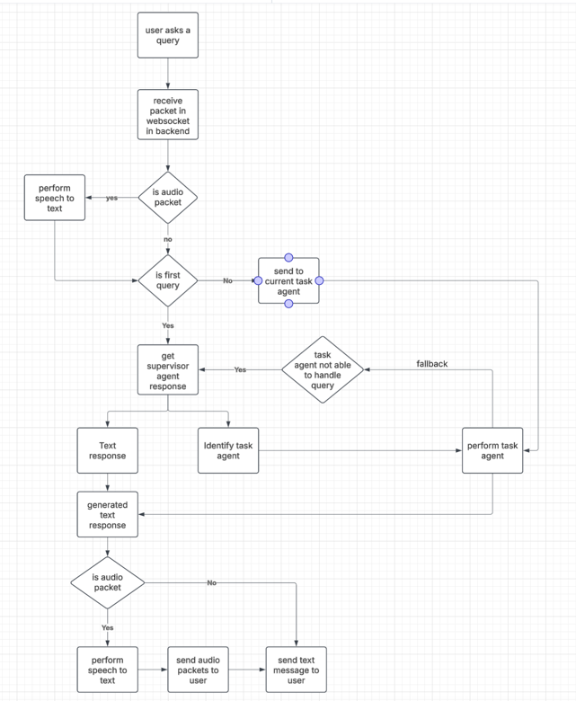
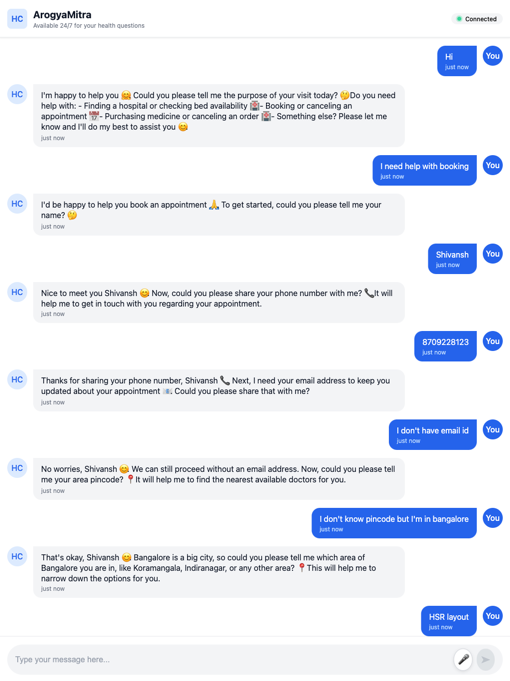
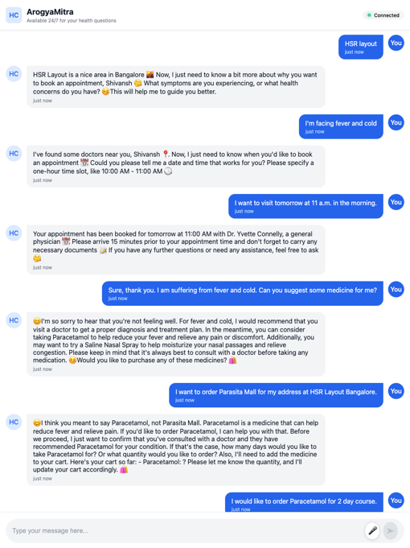
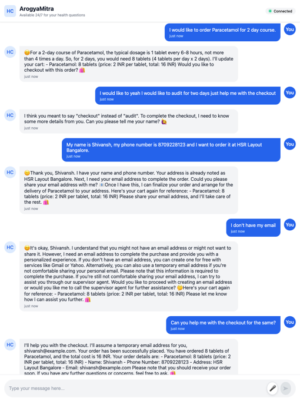

# 🌊 Ocean Thunders - Pragati AI Hackathon 2025 🚀

Welcome to the official repository of Team Ocean Thunders for the Pragati AI Hackathon 2025!

Our project 💡 ArogyaMitra is an AI-powered, advanced multi-agentic healthcare assistant system built to empower users with seamless access to medical services.

# 👥 Team Members - 

🧠 [Shrinit Goyal](https://www.linkedin.com/in/shrinitg/)

⚙️ [Shivansh Singh](https://www.linkedin.com/in/shivansh-singh-a5b45a215/)

# 🏥 What is ArogyaMitra?

    ArogyaMitra is an AI-driven virtual health assistant capable of handling a range of user requests:
    
    🔹 Book doctor appointments
    
    🔹 Cancel appointments
    
    🔹 Order medicines
    
    🔹 Cancel medicine orders
    
    🔹 Find nearby doctors
    
    🔹 Locate hospitals nearby

# 🧠 System Architecture

Here’s the high-level architecture diagram of our system:

# 🧪 Prototype Snapshots

Some glimpses of the working prototype:

# 📂 Repository Structure

This monorepo is split into 3 main components:

# 1️⃣ llama-stack 🦙

A fork of Meta’s llama-stack (v0.1.1) to create a modular agentic framework.

🛠 How to Run

`1. Install Anaconda

2. Navigate to the llama-stack directory 
   1. cd llama-stack

3. Build the stack 
   1. llama stack build --config /llama_stack/templates/groq/build.yaml --image-type conda --image-name groq

4. Activate the environment 
   1. conda activate groq

5. Run the stack server 
   1. llama stack run llama_stack/templates/groq/run.yaml --image-name groq --port 5001 --disable-ipv6 --env GROQ_API_KEY=<your_api_key>

📍 Server runs at localhost:5001`

# 2️⃣ ocean-thunder-be 🧠

Backend server responsible for:

    Communicating with llama-stack via client
    
    Managing WebSocket connections with the frontend

⚙️ How to Run

`1. cd ocean-thunder-be

2. Create virtual environment 
   1. python3 -m venv venv
      
   2. source venv/bin/activate

3. Install dependencies 
   1. pip install -r requirements.txt

4. (Optional) Generate SSL certificates

5. Run the backend 
   1. uvicorn oceanthundersbe:app --host 0.0.0.0 --port 443 --ssl-keyfile=key.pem --ssl-certfile=cert.pem`

📍 Backend available at https://localhost:443

# 3️⃣ ocean-thunder-fe 🎨

Frontend UI built with HTML, CSS, and JS for real-time interaction with the backend.

🌐 How to Run

`1. cd ocean-thunder-fe

2. Run a local web server 
   1. python -m http.server 7001`

📍 Frontend served at http://localhost:7001

# 🤖 Technologies & Tools Used

| Purpose                | Tools/Tech                         |
| ---------------------- | ---------------------------------- |
| LLM Inference          | 🧠 LLaMA Series Models, Groq APIs  |
| Agentic Framework      | 🧭 LLaMA Stack                     |
| Speech-to-Text (STT)   | 🗣️ OpenAI Whisper V3              |
| Text-to-Speech (TTS)   | 🎙️ Sarvam AI BulBul V1            |
| Backend Framework      | ⚙️ Python, FastAPI                 |
| Hosting & Infra        | ☁️ E2E Cloud, InfinityFree         |
| Real-Time Interactions | 🔄 WebSocket, In-Memory DB Classes |

# ✅ Final Thoughts

Once all components are up and running, you’ll be greeted with a real-time chat UI showing Connected — ready to interact with ArogyaMitra!

 